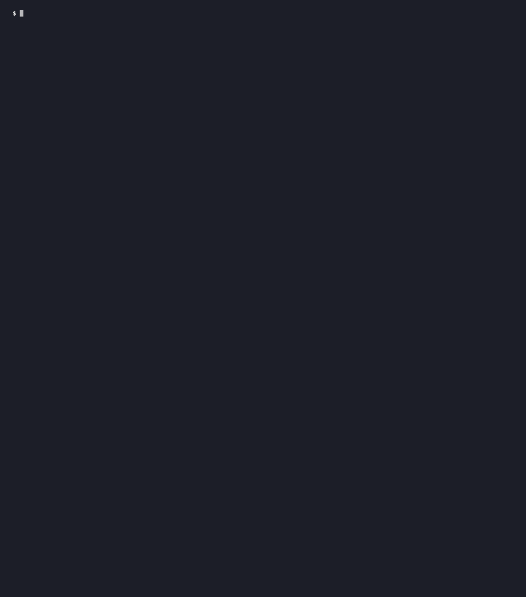

# grokpatrol

[](https://github.com/optimuslabs-io/grokpatrol/actions/workflows/ci.yml)
[](https://github.com/optimuslabs-io/grokpatrol/releases/latest)
[](LICENSE)
[](go.mod)


[](https://pkg.go.dev/github.com/optimuslabs-io/grokpatrol)


Detects, on your machine, whether the **Grok Build CLI** collected and queued your
git repositories for upload to xAI — and tells you **which secrets went with them**.



<!-- Regenerate with `vhs demo.tape` (charmbracelet/vhs) in a throwaway VM or container:
     `make demo` plants live indicator strings that can trip corporate EDR. -->

> **Live incident.** The Grok Build CLI was found silently uploading whole git repositories to
> xAI. If you have run it, the question is not whether it *could* — it's what left your disk.

The Grok Build CLI was found to silently upload entire git repositories to Google Cloud Storage. The upload was performed by a background collector that ran **outside the tool-call permission system**, so it fired even in sessions where the model was denied file access. What it shipped:

- every tracked file at git HEAD,
- every git object reachable from HEAD,
- **files deleted from the checkout but still reachable in git history** — which is
  exactly where secrets tend to hide.

Confirmed affected: `0.2.93`. Reported still present in versions through at least `0.2.99`.
grokpatrol detects Grok versions `0.1.212` through the latest observed.

Most published indicators were network-based — you had to be watching the wire while it
happened. `grokpatrol` answers the question you can still ask afterwards: **what evidence
is left on this disk, which repos were taken, and what do I have to rotate?**

## Install

### 1. One-liner

```sh
curl -fsSL https://raw.githubusercontent.com/optimuslabs-io/grokpatrol/main/install.sh | sh
```

Detects your OS and architecture, downloads the matching release binary, **verifies it
against SHA256SUMS before installing** (aborting on any mismatch), and installs to
`~/.local/bin` if that is on your PATH, else `/usr/local/bin`.

macOS and Linux only; Windows is not currently built or supported.

### 2. Build from source through the Go module proxy

```sh
go install github.com/optimuslabs-io/grokpatrol/cmd/grokpatrol@latest
```

### 3. Download and verify

Grab the binary for your platform plus `SHA256SUMS` from the
[releases page](https://github.com/optimuslabs-io/grokpatrol/releases), then:

```sh
shasum -a 256 -c --ignore-missing SHA256SUMS      # sha256sum on Linux

# Prove the binary was built by this repo's release workflow (sigstore):
gh attestation verify grokpatrol_v0.1.16_darwin_arm64 -R optimuslabs-io/grokpatrol

chmod +x grokpatrol_v0.1.16_darwin_arm64 && mv grokpatrol_v0.1.16_darwin_arm64 /usr/local/bin/grokpatrol
```

Replace the tag and platform to match what you downloaded — `<os>` ∈ `{darwin, linux}`,
`<arch>` ∈ `{amd64, arm64}`. [AGENTS.md](AGENTS.md) has a copy-paste snippet that resolves the
latest tag and asset name for you, no hardcoding.

The checksum proves the download arrived intact. The attestation proves something
stronger: the binary was built from this repository's source by its release workflow,
recorded in a transparency log that a compromise of this repo could not rewrite.

## Use

```sh
grokpatrol                    # scan this machine (summarized output)
grokpatrol --verbose          # scan this machine (full archive & secret list)
grokpatrol --json             # machine-readable, for fleet collection (all details)
```

The default report is a transparent **summary**: it names totals (archive counts, secret counts),
tells you which ones matter most (secrets deleted from your checkout), and points you to `--verbose`
and `--json` for the complete receipt. The summary is not a redaction — it's an admission of
what it is, with pointers to everything it withholds.

`--verbose` lists every `gs://` destination, every secret file by name and blob id, and all evidence rows.
`--json` is the complete forensic record for fleet collection or automated tools.

For the full flag list — including `--full-secrets-search` (match secret *contents* against the
gitleaks rule set, not just filenames), `--history-scope`, and repeatable `--scan-root` — run
`grokpatrol --help`.

### Watch it work

The report itself goes to stdout, so `grokpatrol --json | jq` still works while you
watch. `--quiet` silences it.

```
grokpatrol v0.1.16 scanning /Users/you

  → deepscan  walking the filesystem for grok homes, upload queues, staged archives, and executables carrying the bucket name
    ✓ deepscan  1 executable carrying the bucket name, 1 upload queue, 2 staged archives (28ms)
  → logs      reading Grok's logs (incl. rotated and gzipped) for repo_state.upload.start / .enqueued events
  → queue     listing the upload_queue: staged codebase archives, and manifests naming the destination bucket
  → config    checking config.toml for BOTH upload mitigations: harness.disable_codebase_upload and telemetry.trace_upload
  → version   inferring the Grok version from install manifests, package metadata and binary strings
    ✓ logs      2 repositories with 3 archives QUEUED FOR UPLOAD, 1 repository collected, upload unconfirmed
    ✓ queue     2 codebase archives staged (371.2 KB), 1 manifest naming the bucket
    ✓ config    NEITHER mitigation set: uploads are not blocked
    ✓ version   0.1.212, 0.2.39, 0.2.51, 0.2.56 -- REPORTED AFFECTED
  → secrets   git rev-list --objects HEAD minus the working tree, per implicated repository
    ✓ secrets   3 secret files, 2 DELETED FROM THE CHECKOUT but still in history

VERDICT: EXPOSED
  Queued       2 repos · 3 archives → gs://grok-code-session-traces/
  Exfiltrated  unconfirmed (enqueue logged; completion is not)
  Repos        2 repos touched · 3 credential paths

  ACTION
    Rotate credentials from full git history of touched repos.
    Mitigate uploads: set harness.disable_codebase_upload = true and telemetry.trace_upload = false in ~/.grok/config.toml (both required; see MITIGATIONS).

CREDENTIAL PATHS   (filenames and object ids only -- contents were never read by this tool)
  PATH        PATHS  DELETED
  ~/work/api  3      2

  3 credential paths found. --verbose lists them by name, class and blob id; --json has the full record.
  Rotate the 2 you cannot see in your own checkout first.
```

A detector that finds nothing says so out loud, rather than printing nothing: a silent line is
indistinguishable from a detector that crashed, and a crash that produces no findings reads
exactly like a clean host.

Exit codes, for scripting:

| Code | Meaning |
|---|---|
| `0` | The scan ran and printed a report — whatever it found. Read `VERDICT` in the report, or `"verdict"` in `--json`, for the finding. |
| `1` | The tool itself failed (bad flags, internal error). **Never used for a finding.** |

The exit code answers only "did grokpatrol run" — it cannot tell you whether the host is
CLEAN, INDETERMINATE, EXPOSED or COMPROMISED. Check the report (`--json | jq -r .verdict`
for scripting) for that.

## What it looks at

| Indicator | Where |
|---|---|
| `repo_state.upload.start` / `.enqueued` events | `~/.grok/logs/unified*.jsonl` (incl. rotated + gzipped) |
| Staged archives awaiting upload | `~/.grok/upload_queue/` |
| Manifests naming the destination bucket | staged `metadata.json` → `gs://grok-code-session-traces/` |
| The bucket name embedded in the binary | any executable on disk |
| Both missing mitigations | `~/.grok/config.toml` → see below |
| Affected version | install manifests, package metadata, binary strings |
| **Secrets in the uploaded object set** | `git rev-list --objects HEAD` minus the working tree |

### Secrets

The secrets section is the one that matters most. The exfiltrated set was *"every git object
reachable from HEAD"*, which is precisely what `git rev-list --objects HEAD` enumerates.
Subtracting the current checkout from it yields the files that are **gone from your working
tree but still alive in history** — the deleted `.env`, the rotated-out `.pem`.

**In default mode**, the report shows you the count of secrets and specifically flags how many are
deleted from your checkout (the ones you cannot find by looking) — because those are the priority:
they're off your disk but alive in git history, and they went out first.

**With `--verbose`**, each secret is reported with its **full path and git object id**, which `rev-list`
prints on the same line as the path. That is the one claim in this report you can check for yourself:

```sh
git -C ~/work/payments-api cat-file -p d6da7879bc89     # the .env you deleted, still in history
```

grokpatrol never ran that command on this scan: a default run does not read file contents at
all, so it hands you a pointer to a file it never opened. (With `--full-secrets-search` it
reads blob contents in memory to match them against the gitleaks rule set — and still prints
only the pointer, never the value.)

## Guarantees

These are enforced mechanically:

- **No network. Ever.** Proven by the linker: `make verify-deps` asserts that `net`,
  `net/http` and `crypto/tls` do not appear in `go list -deps`, and that `go.sum` is empty.
  A binary with no networking packages linked in cannot phone home. There is no remote
  check, no telemetry, no update ping.
- **Zero dependencies.** Stdlib only. A tool that hunts for unaudited code should not
  ship any.
- **Read-only.** Every file open goes through one function, with `O_RDONLY`. There is no
  `--out` flag, no cache, no state directory. A test snapshots `.git` before and after a
  scan and demands byte-for-byte equality.
- **The `grok` binary is never executed** — not even `grok --version`. It carries a
  collector that runs outside the permission system; launching it to ask a question could
  itself start a session. Version is inferred passively.
- **Secret *values* are never printed; secret *locations* always are.** The report prints the
  full path and git object id of every exposed credential file, because a rotation checklist
  you cannot locate is useless. A default run never reads their contents at all — it matches
  filenames only. Opt-in `--full-secrets-search` reads implicated blobs and matches their
  contents against the gitleaks rule set (222 rules, MIT-licensed, transcribed — still zero
  dependencies), in transient memory: `model.Evidence` and `SecretHit` have no field capable
  of holding file contents, and leak tests grep every output channel (stdout, stderr, `--json`)
  for planted values. A line *number* is evidence, a line's *text* never is. `~/.grok/auth.json`
  is checked for existence and never opened.
- **Every positive finding cites something you can go and look at.** A queued archive is
  reported with its `gs://` destination and the log file and line Grok wrote when it queued it;
  a staged archive with its SHA-256; an exposed secret with its blob id. A verdict you have to
  take on faith is not a forensic result.
- **Your archives are never unpacked.** A `*codebase.tar.gz` in the upload queue is your
  own source code. It is recorded by name, size and SHA-256. `archive/tar` is not imported.
- **A degraded scan never reports CLEAN.** If macOS TCC blocked `~/Documents`, the verdict
  is INDETERMINATE, and the report says which directories it could not see.


## Two things worth knowing

**Absence of evidence is not evidence of absence.** A drained upload queue means the
archives went *out*, not that they never existed. Rotated-away logs leave no trace. The
report's "BLIND SPOTS" section prints on every run, including clean ones, for exactly
this reason.

**A file that mentions the bucket is not an install.** grokpatrol distinguishes an
executable that *contains* the collector from a text file that merely *names* the
indicators — your own notes, an IoC list, another detection tool, or this repo's test
fixtures. Executables and packed bundles (≥512 KB, since Grok may ship as a Bun/Node
bundle with no executable magic) are reported as an install; small text files are listed
for completeness and do not affect the verdict.

## FAQ

**Did the Grok Build CLI upload my git repositories to xAI?**
grokpatrol answers this for *your* machine, from the evidence left on disk: it reports which
repositories were collected and queued for upload to `gs://grok-code-session-traces/`, and
whether an upload was confirmed. It cannot speak for machines it did not scan. Run it and read
the `VERDICT`.

**Which Grok Build CLI versions are affected?**
`0.2.93` is the confirmed-affected build — publicly reproduced collecting whole repositories and
uploading them. The collector is reported still present through at least `0.2.99`. grokpatrol
detects versions `0.1.212` through the latest observed and labels each build CONFIRMED AFFECTED,
REPORTED AFFECTED, or neither.

**How do I check if Grok uploaded my code after the fact?**
Most published indicators were network-based — you had to be watching the wire while it happened.
grokpatrol is the after-the-fact check: it reads Grok's own logs (including rotated and gzipped),
the `~/.grok/upload_queue/`, staged archive manifests, and the version, then names the repos and
secrets involved. No live capture required.

**The upload queue is empty and my logs rotated — does that mean I'm safe?**
No. A drained queue means the archives went *out*, not that they never existed, and rotated-away
logs leave no trace. That is why a degraded or blind scan reports INDETERMINATE, never CLEAN, and
why the report prints what it could not see on every run.

**How do I stop Grok from uploading my repositories?**
Set **both** mitigations in `~/.grok/config.toml`: `harness.disable_codebase_upload = true` and
`telemetry.trace_upload = false`. Either one alone is not enough — grokpatrol reports a host with
only one set as EXPOSED, not mitigated.

**What secrets were exposed, and which do I rotate first?**
The exfiltrated set was every git object reachable from HEAD, so a secret you *deleted* from your
checkout is still in history and went out with it. grokpatrol flags those first: rotate the
credentials you can no longer see in your own working tree before the rest.

**Does grokpatrol read or transmit my secret values?**
It never transmits or prints them. A default run never even reads them: it matches filenames
only. With `--full-secrets-search` it reads implicated file contents in memory to match them
against the gitleaks rule set, then reports only the location and rule id — the evidence model
has no field that can hold file contents, and leak tests grep every output channel for planted
values. It makes no network calls at all — proven by the linker (`make verify-deps`), which
asserts `net`/`net/http`/`crypto/tls` are not linked in.

**Is it safe to run on a possibly-compromised host?**
That is the design target. grokpatrol is a single static binary, stdlib-only, offline, and
read-only (every file open is `O_RDONLY`; a test proves `.git` is byte-for-byte unchanged after a
scan). It never executes the `grok` binary. Release binaries carry sigstore provenance, so you can
prove one was built by this repo's workflow before running it — see [AGENTS.md](AGENTS.md).

**Can I run grokpatrol across a fleet or in CI?**
Yes. `grokpatrol --json` emits the complete forensic record on stdout for collection; the exit
code is `0` whenever the scan ran (whatever it found) and `1` only on tool failure, so read the
verdict from the report, not the exit status: `grokpatrol --json | jq -r .verdict`.

## Development

`make` on its own lists every target.

| Target | What it does |
|---|---|
| `make build` | build `./dist/grokpatrol` for this machine |
| `make run` | build, then scan this machine (`ARGS="--json"` to pass flags) |
| `make demo` | build a synthetic compromised host and scan it — expect COMPROMISED |
| `make check` | what CI runs: deps + fmt + vet + race tests + cross-compile smoke |
| `make verify-deps` | prove the binary is stdlib-only, with no network and no cgo |
| `make test` / `fuzz` / `bench` | race tests, fuzz the log parser, benchmark the scanner |
| `make fmt` / `vet` | gofmt in place, go vet |
| `make release` | all four platforms, trimmed, CGO-free, with `SHA256SUMS` |
| `make clean` / `distclean` | remove build output; also caches and the demo fixture |

`make demo` is the one worth running. There is no real Grok install to test against, so
the compromised case is constructed: every host-side indicator planted, including a repo
whose secrets were committed and then deleted. It should print `VERDICT: COMPROMISED` and
flag `.env.production` and `certs/prod.pem` as *deleted from checkout, still in history*.

The fixture is generated rather than committed: files carrying a live IoC string trip
corporate EDR, which is a real problem for anyone who clones this.

## Contributing & security

Contributions welcome — [CONTRIBUTING.md](CONTRIBUTING.md) explains the invariants this tool holds
itself to (no network, read-only, stdlib-only) and how to work within them. Found a security issue?
Please report it privately via [SECURITY.md](SECURITY.md), not a public issue.

## License

Apache-2.0 — see [LICENSE](LICENSE). Secret-detection rules are transcribed from
[gitleaks](https://github.com/gitleaks/gitleaks) (MIT) — see [NOTICE](NOTICE).
